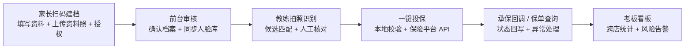
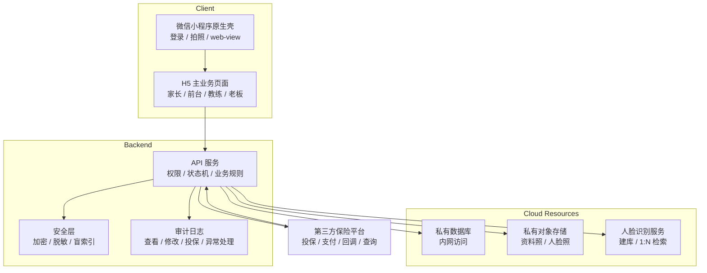

<p align="center">
  <h1 align="center">儿童保险智能投保系统 Case Study</h1>
  <p align="center">从线下儿童身份核验，到 AI 人脸识别、一键投保、异步承保回调与未成年人数据安全设计</p>
</p>

<p align="center">
  <strong>真实商业项目</strong> ·
  <strong>2.5 万元独立交付</strong> ·
  <strong>9 家门店 / 8 个工商主体</strong> ·
  <strong>未成年人数据安全</strong> ·
  <strong>脱敏开源</strong>
</p>

> 这个仓库不是原生产系统源码，而是我为作品集整理的脱敏 case study。它只保留可公开的通用设计、核心安全逻辑和产品复盘，不包含真实客户数据、生产配置、服务器地址、第三方接口密钥或客户交付代码。

## 项目速览

| 维度 | 内容 |
| --- | --- |
| 项目类型 | 独立承接的真实商业项目 |
| 项目目标 | 用 AI 人脸识别辅助儿童身份核验，并打通一键投保与承保状态回写 |
| 使用角色 | 家长、前台、教练、老板 |
| 业务范围 | 9 家门店，8 个工商主体 |
| 项目金额 | 2.5 万元独立交付 |
| 核心难点 | 未成年人敏感数据安全、保险异步状态准确性、门店权限边界、上线前安全验证 |
| 本仓库内容 | 脱敏产品复盘、架构文档、通用安全代码样例、测试用例 |

## 为什么这个项目有代表性

这个项目的代表性不在于“做了一个小程序”，而在于客户一开始就强烈关注**未成年人身份数据安全**。系统要处理儿童姓名、身份证号、人脸资料照、监护人手机号、门店营业主体和保险订单状态，任何一个环节出错都可能造成数据泄露、重复扣费、投保主体错误或孩子实际未承保。

因此我没有把安全当成上线后的补丁，而是在需求阶段就把它变成产品约束：

- 身份数据不能明文裸存
- 照片不能被公网直接访问
- 数据库不能暴露在公网
- 教练不能看到全量客户资料
- 人脸识别结果不能直接触发投保
- 保险承保回调丢失时不能让订单永久卡住
- 资源采购要服务于安全边界，而不是只追求最低成本

## 我的角色

我独立承接并完成这个 0-1 商业项目，覆盖：

- 需求访谈、业务流程梳理、一期范围收敛
- 产品方案、角色权限、异常流程和安全方案设计
- 技术框架设计与云资源采购评估
- 小程序/H5/后端/数据库/对象存储/人脸识别/保险 API 的交付推进
- 上线前备案、部署、安全加固、渗透测试配合与问题复盘

## 业务闭环

面向某连锁攀岩馆的内部员工系统，目标是把线下投保流程从“电话问家长 + 手工核验 + 人工记录状态”改成一套可追踪的业务闭环：



## 安全驱动的云资源采购

客户对儿童数据安全非常敏感，所以云资源不是“随便买一台机器跑起来”，而是围绕数据隔离、访问控制、备份恢复和上线审核来采购。

| 采购项 | 为什么需要 | 对应的安全/交付问题 |
| --- | --- | --- |
| 云服务器 | 承载后端 API、权限校验、保险接口转发，不让密钥出现在前端 | 所有第三方密钥只在服务端，前端不能直连保险平台或云 API |
| 独立数据库 | 存储儿童档案、投保订单、授权记录、审计日志 | 数据库可关闭公网入口，只允许应用服务器内网访问 |
| 对象存储 | 存储儿童资料照和人脸建库图片 | 图片放私有桶，前端只拿短期访问地址，避免链接长期传播 |
| HTTPS 证书 | 小程序 web-view、接口调用和家长填报页必须走 HTTPS | 支持备案、微信域名校验、传输加密和正式上线 |
| 主机安全/登录加固 | 防止服务器被扫描、弱口令爆破或异常登录 | 配合密钥登录、最小权限、备份和安全巡检 |

更完整的采购取舍见 [docs/cloud-procurement-rationale.md](docs/cloud-procurement-rationale.md)。

## 技术亮点

- [字段级加密与盲索引](src/field-crypto)：AES-256-GCM 加密姓名/证件号/手机号，同时用 HMAC 指纹支持不解密查重
- [自然日保障去重](src/coverage-window)：保险按自然日生效，不能用滚动 24 小时误判“已投保”
- [姓名静默失败防御](src/insured-name-guard)：在本地前置拦截会导致保险平台收单但不承保的姓名格式
- [保险状态机](src/insurance-state-machine)：投保、支付、承保、失败、重复、卡单等状态显式建模
- [范围化权限](src/scoped-rbac)：教练、前台、老板有不同数据边界，老板是小门店真实经营中的权限超集

## 系统架构



## 仓库结构

```text
docs/
  product-overview.md              产品概览
  architecture.md                  系统架构
  security-and-privacy.md          安全与隐私设计
  cloud-procurement-rationale.md   云资源采购依据
  async-integration.md             保险异步集成可靠性
  decisions/                       关键产品与技术决策

src/
  field-crypto/                    字段加密、盲索引、脱敏
  coverage-window/                 自然日保障去重
  insured-name-guard/              姓名静默失败防御
  insurance-state-machine/         保险订单状态机
  scoped-rbac/                     角色与门店权限边界

tests/                             不依赖外部服务的单元测试
```

## 开源边界

这个仓库公开的是可以复用的**通用能力实现**和**设计文档**：

- 数据安全与隐私保护设计
- 脱敏后的业务架构图
- 通用字段加密、去重、状态机和权限样例
- 安全测试与上线风险复盘

没有公开：

- 真实客户名称、真实生产仓库、合同、报价单
- 服务器 IP、域名、数据库地址、小程序 AppID
- 第三方保险平台接口文档、真实字段、签名规则和密钥
- 真实儿童姓名、身份证号、人脸照片、手机号和保单号

## 界面截图

截图会放在 `screenshots/`，只使用脱敏演示数据。计划包含：

- 家长扫码建档页
- 前台待确认档案页
- 教练拍照识别与人工核对页
- 投保状态与异常处理页
- 老板经营看板

## 运行测试

这个仓库不依赖外部服务，也不需要安装 npm 包：

```bash
npm test
```

## 延伸阅读

- [产品概览](docs/product-overview.md)
- [系统架构](docs/architecture.md)
- [安全与隐私设计](docs/security-and-privacy.md)
- [云资源采购依据](docs/cloud-procurement-rationale.md)
- [保险异步集成可靠性](docs/async-integration.md)
- [开源边界说明](docs/open-source-boundary.md)
