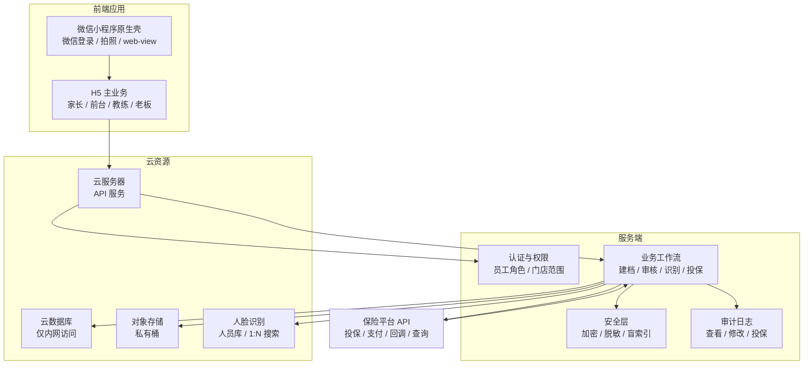
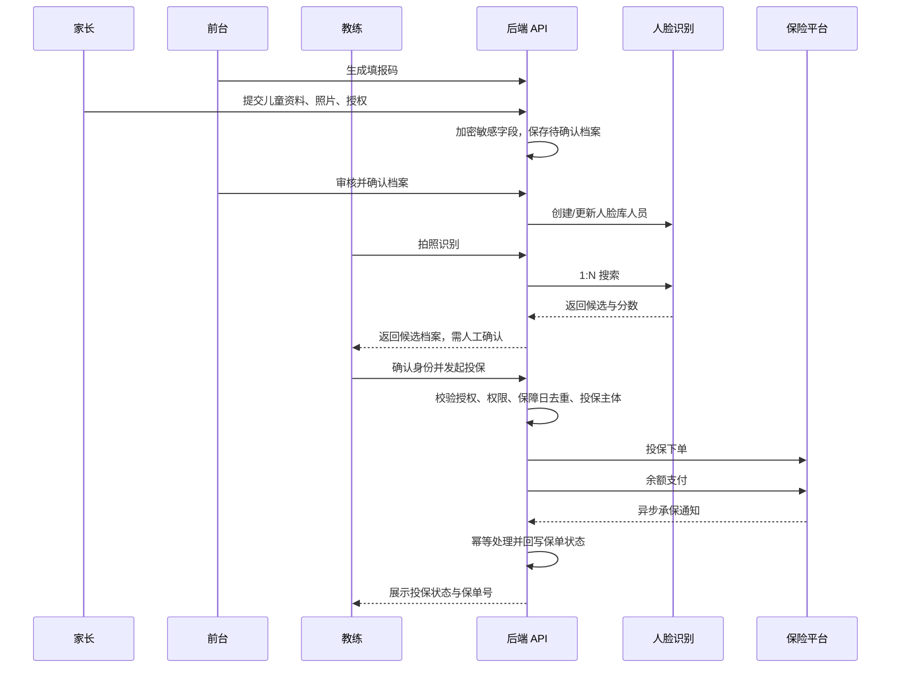

# 系统架构

## 分层架构

```mermaid
flowchart TB
  subgraph app["前端应用"]
    shell["微信小程序原生壳<br/>微信登录 / 拍照 / web-view"]
    web["H5 主业务<br/>家长 / 前台 / 教练 / 老板"]
  end

  subgraph server["服务端"]
    auth["认证与权限<br/>员工角色 / 门店范围"]
    workflow["业务工作流<br/>建档 / 审核 / 识别 / 投保"]
    security["安全层<br/>加密 / 脱敏 / 盲索引"]
    audit["审计日志<br/>查看 / 修改 / 投保"]
  end

  subgraph cloud["云资源"]
    cvm["云服务器<br/>API 服务"]
    db["云数据库<br/>仅内网访问"]
    cos["对象存储<br/>私有桶"]
    face["人脸识别<br/>人员库 / 1:N 搜索"]
  end

  insurer["保险平台 API<br/>投保 / 支付 / 回调 / 查询"]

  shell --> web
  web --> cvm
  cvm --> auth
  cvm --> workflow
  workflow --> security
  workflow --> audit
  workflow --> db
  workflow --> cos
  workflow --> face
  workflow --> insurer
  insurer --> workflow
```

## 业务时序

```mermaid
sequenceDiagram
  participant Parent as 家长
  participant Frontdesk as 前台
  participant Coach as 教练
  participant API as 后端 API
  participant Face as 人脸识别
  participant Insurer as 保险平台

  Frontdesk->>API: 生成填报码
  Parent->>API: 提交儿童资料、照片、授权
  API->>API: 加密敏感字段，保存待确认档案
  Frontdesk->>API: 审核并确认档案
  API->>Face: 创建/更新人脸库人员
  Coach->>API: 拍照识别
  API->>Face: 1:N 搜索
  Face-->>API: 返回候选与分数
  API-->>Coach: 返回候选档案，需人工确认
  Coach->>API: 确认身份并发起投保
  API->>API: 校验授权、权限、保障日去重、投保主体
  API->>Insurer: 投保下单
  API->>Insurer: 余额支付
  Insurer-->>API: 异步承保通知
  API->>API: 幂等处理并回写保单状态
  API-->>Coach: 展示投保状态与保单号
```

## 为什么不是纯小程序

如果所有页面都做成小程序原生，任何页面调整都可能重新走微信审核。这个项目上线前需要频繁调整异常文案、投保状态、前台流程和老板看板，因此采用“小程序原生壳 + H5 主业务”的混合架构。

代价是需要处理 web-view 登录态交接和域名备案，但收益是业务迭代速度更高，尤其适合一期真实门店试运行阶段。

