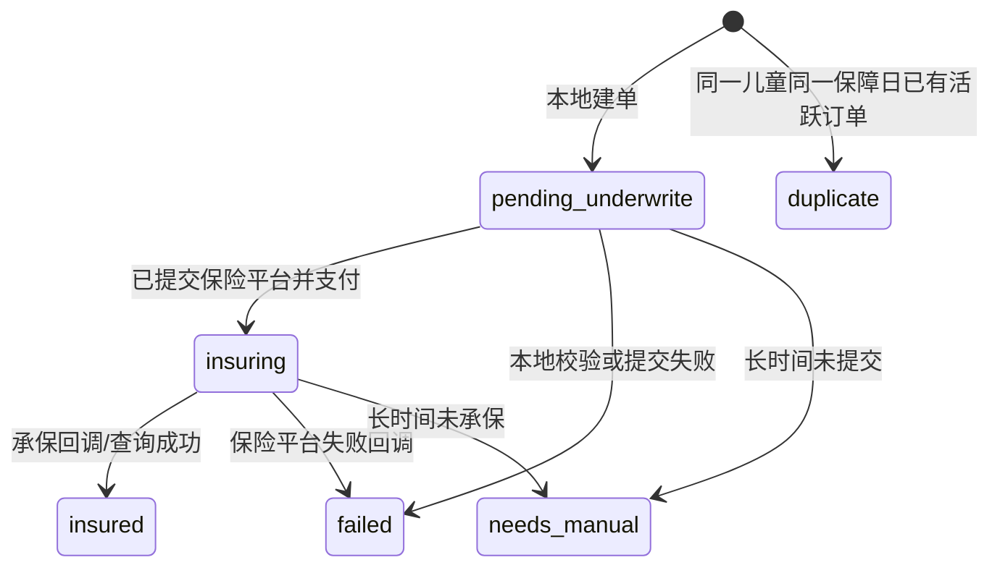

# 保险异步集成可靠性

保险平台集成不是一次 HTTP 成功就结束。投保通常会拆成下单、支付、承保、回调和保单查询多个阶段。

## 状态模型

## 关键风险

| 风险 | 后果 | 设计 |
| --- | --- | --- |
| 回调重复投递 | 同一订单被多次更新 | 使用回调事件 ID 幂等处理 |
| 回调乱序 | 已承保状态被旧的处理中状态覆盖 | 状态更新只允许向前推进 |
| 回调丢失 | 本地订单永久停在投保中 | 定时保单查询对账 |
| 余额不足 | 所有门店无法投保 | 老板端余额告警 |
| 同一儿童重复投保 | 重复扣费或重复出单 | 同一儿童同一保障日唯一约束 |
| 本地建单但未提交 | 孩子无保障却占住去重键 | pending 状态超时检测 |

## 为什么要做本地去重

第三方平台不一定替业务方做“同一儿童同一天只能投一次”的约束。这个约束最了解业务的人应该在本系统里做，并且不能只靠“先查后写”的应用层判断，需要数据库唯一约束兜底。

