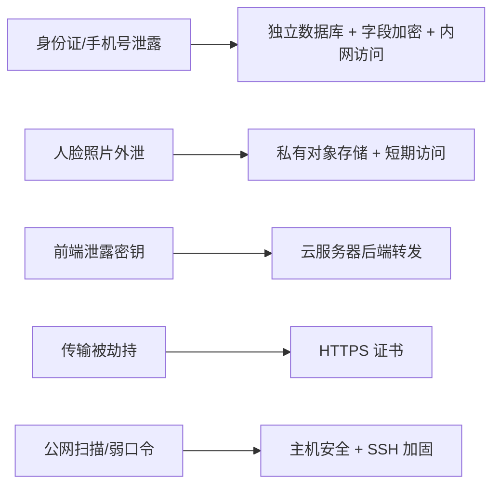

# 云资源采购依据

客户对儿童数据安全有强要求，因此云资源采购不是简单比较价格，而是围绕“数据放在哪里、谁能访问、怎么备份、出了问题能不能追踪”来做取舍。

## 采购清单的产品逻辑

| 资源 | 采购/评估原因 | 产品角度的解释 |
| --- | --- | --- |
| 云服务器 | 运行后端 API、保险平台适配层、权限校验和审计逻辑 | 所有高风险动作必须经过服务端，不能让小程序直接接触密钥和三方接口 |
| 云数据库 | 保存员工、门店、儿童档案、授权记录、投保订单、审计日志 | 数据库可与公网隔离，只允许服务器内网访问，降低被扫描和撞库风险 |
| 对象存储 | 保存儿童资料照和人脸建库图片 | 图片不放应用服务器磁盘，使用私有桶和短期访问策略控制传播范围 |
| HTTPS 证书 | 满足小程序、H5、API 的 HTTPS 访问要求 | 支持微信域名校验、备案上线和传输层加密 |
| 主机安全 | 登录加固、异常扫描、基础防护和安全巡检 | 真实生产环境会上公网，不能只依赖“没人知道地址” |

## 为什么不只买一台便宜服务器

如果把应用、数据库、图片都放在一台服务器上，短期开发成本低，但会带来三个问题：

1. 数据库端口和应用入口更容易混在一个公网边界里
2. 儿童照片和业务代码在同一磁盘上，备份和权限边界不清晰
3. 后续做恢复、迁移、安全排查时缺少清晰分层

本项目的一期规模不是高并发，真正的难点是敏感数据保护、权限边界和投保状态准确性。因此采购决策优先服务于安全和可运维，而不是堆高配置。

## 资源与风险的对应关系

## 面试可讲的取舍

这个项目让我意识到，产品经理做技术方案不是为了替工程师写代码，而是要把业务风险翻译成系统边界：

- 客户说“孩子资料不能泄露”，对应的是字段加密、脱敏、权限和审计
- 客户说“照片不能乱传”，对应的是私有对象存储和短期访问
- 客户说“系统要正式上线”，对应的是域名、HTTPS、备案和小程序审核
- 客户说“不能错保漏保”，对应的是状态机、对账、卡单检测和异常处理

